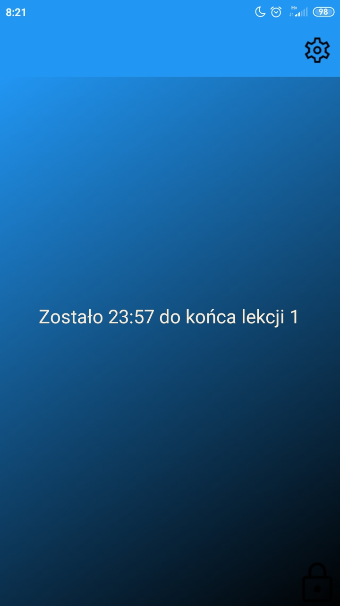

# O czym myśli każdy uczeń na lekcji?
Proste. O końcu lekcji. Ja to wiem, ty to wiesz. Wszyscy wiedzą. Nie ma kogo oszukiwać.
# Albo czy zdażyło ci się kiedyś patrzeć z niecierpliwością na godzinę i liczyć, kiedy te upragnione, magiczne 15 minut minie?
Pewnie też.

**Dlatego właśnie napisałem aplikację, która ułatwi Ci życie.**

W czym apka Ci pomoże? 

+ Wyświetli w powiadomieniu, ile czasu do końca lekcji zostało

+ Wyśle powiadomienie o upływie czasu

+ Również na ekranie blokady

+ Wyśle również powiadomoenie o upływie 15 minut (o ile będziesz chciał/a)

+ Wiadomo, że dzwonki idealnie nie działają. W aplikacji możesz dostosować opóźnienie dzwonka

> W szkole telefon powinien być wyciszony. Jeśli jednak nie jest, (czemu akurat się nie dziwię) to polecam wyłączyć dżwięki powiadomienia dla tej aplikacji)
